just-js is a small and performant javascript runtime for linux written in C+ that uses V8 engine.

Since it's built to run only on linux it's useful for learning more about javascript and v8 because
it's very concise without many ifdefs to different platforms.

Some of you may already know this but things like console.log / setTimeout / setInterval are not part 
of EcmaScript, if we search for it we won't find any reference. Instead this is part of the JS Environment
more specifically the JS runtime.

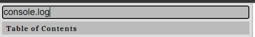
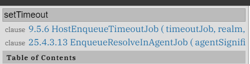
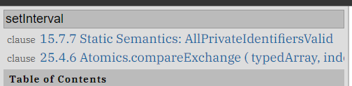
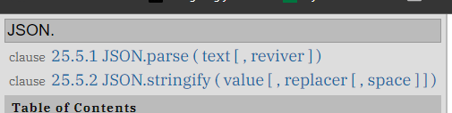
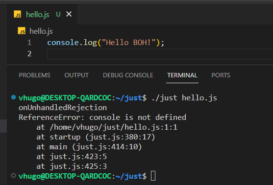
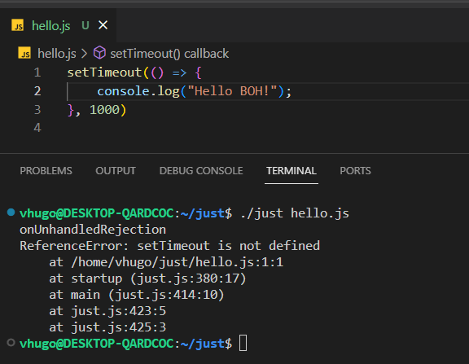

But where does that lives then? How does that works? You may be think, what kind of JS is this without console.log? How am I going to debug my code?

Well just does implements a print function where you can log things out let's take a look on how this is done.

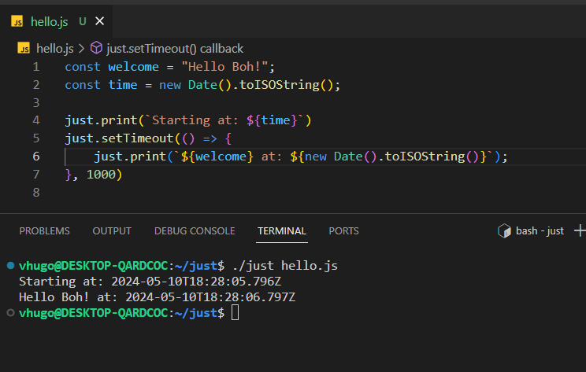

When we call the command ./just hello.js we will endup on the main function, of the runtime, this is written in C++.
This function is responsible for initialize the program, it will basically create a v8 platform and initialize it. 
Adding a printf function to see what is being passed to main we can see that the first arg is the just command itself and the second one is our file hello.js 

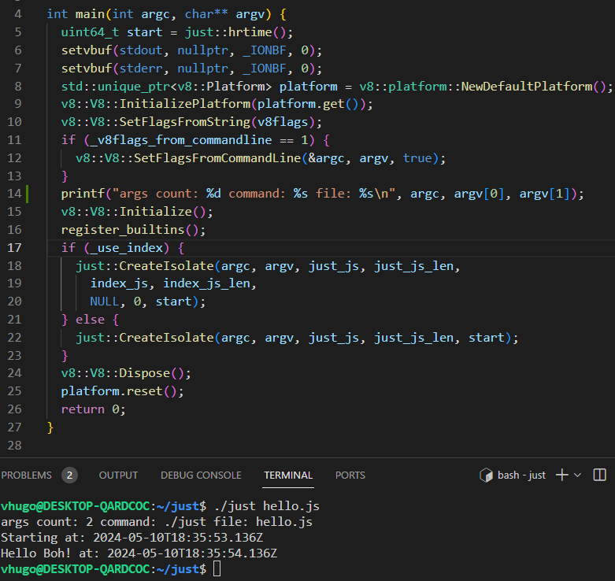

then the createIsolate functions is called. This method will be responsible for setting the just object inside the global environment the just::Init function is responsible for setting the functions inside just object.
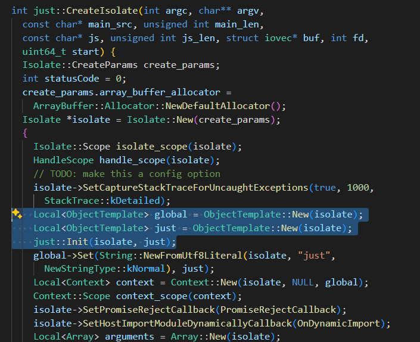`

On the init function we can see that just and v8 values are set
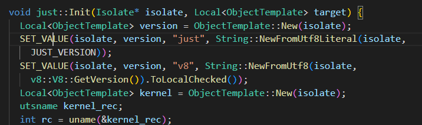

Not only that but also our function print

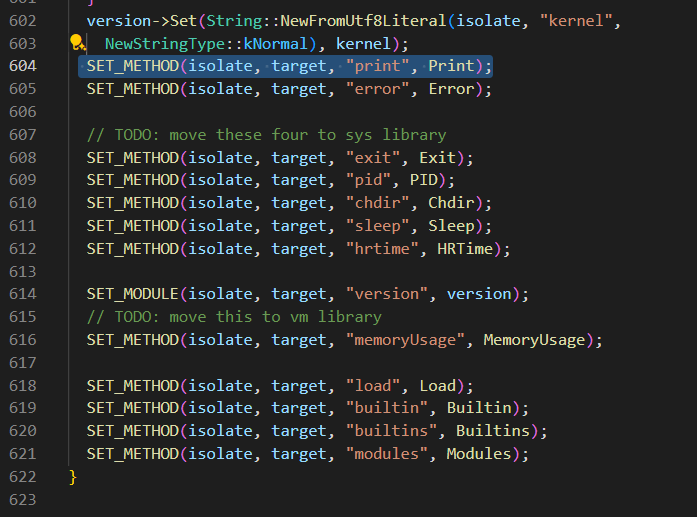

and we can enter into that function to see how it's done, at the end we have a c++ code that calls fprintf function 
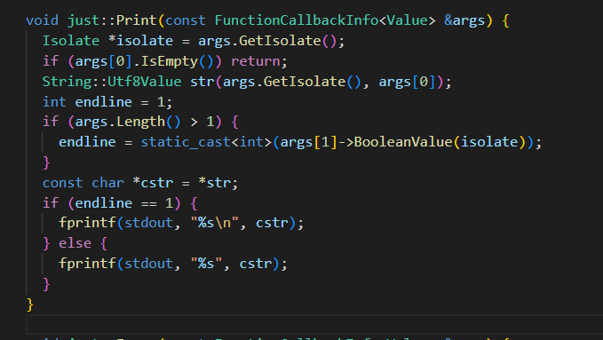 we can even update this function to see if that's really what is being called

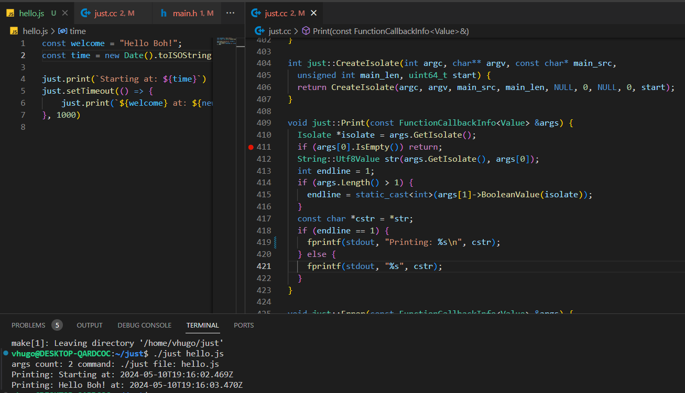

and here is our setTimeout but wait, this is JS code, well yeah, the v8 engine will get 
this js code, stringfy it and pass it to V8, v8 will basically eval this stringfied function and execute.

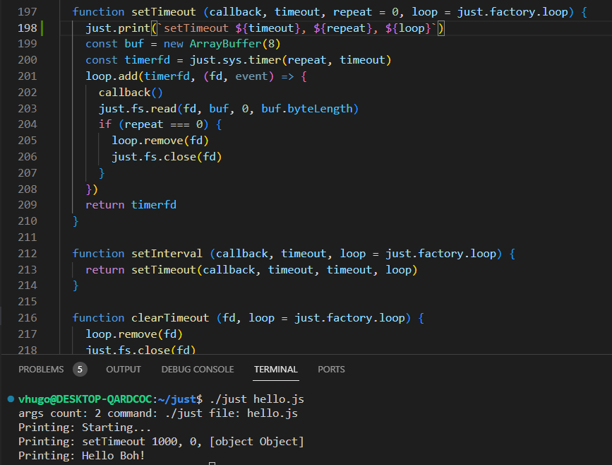